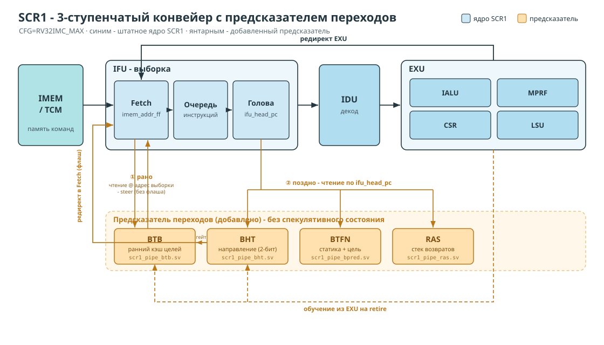
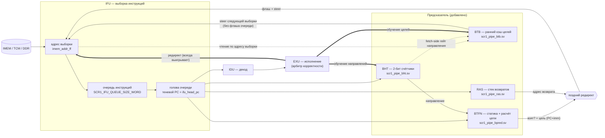

# Предсказатель переходов для SCR1 (RV32IMC, 3-ступенчатый конвейер)

Этот каталог документирует предсказатель переходов, встроенный в ядро **Syntacore
SCR1** (конфигурация `RV32IMC_MAX`). Здесь — как он устроен, где именно врезан в
конвейер и почему сделан именно так. Для каждого узла есть отдельный подробный файл
с разбором кода по строкам; этот README — обзорная карта.

> TL;DR. К штатному ядру добавлены четыре структуры — **BTB** (кэш целей),
> **BHT** (направление), **BTFN** (статический базовый слой) и **RAS** (возвраты).
> Предсказание делается в **двух точках** (рано — на адресе выборки; поздно — на
> выходе очереди), обучается из ступени исполнения, **не хранит спекулятивного
> состояния** и не является источником истины: любая ошибка стоит максимум флаша,
> а корректность всегда восстанавливает EXU.

---

## Конвейер SCR1 с предсказателем



<details>
<summary>Та же схема в Mermaid (правится прямо в markdown)</summary>


</details>

**Две точки предсказания:**
- **Рано** — `BTB` читается по адресу выборки `imem_addr_ff` (ещё до декода) и
  **меняет только следующий адрес выборки**, без флаша очереди → убирает «пузырь
  взятого перехода» прямо на этапе выборки. Направление раннего steer'а
  подтверждает `BHT` через второй порт чтения (fetch-side гейт).
- **Поздно** — на голове очереди (`ifu_head_pc`) работают `BTFN` (цель `PC+imm` +
  направление), `BHT` (динамическое направление) и `RAS` (цель возврата). Они
  делают штатный редирект с флашем, когда переход дошёл до головы очереди.
- **Арбитр** — `EXU`: реальный mispredict перекрывает любое предсказание; обе
  обучаемые таблицы (BTB, BHT) тренируются из EXU на retire.

---

## Немного теории

Предсказание перехода делится на два независимых вопроса:
1. **Направление** (*direction*): будет ли условная ветка взята? → **BHT** (+ BTFN
   как статический дефолт).
2. **Цель** (*target*): если взят — куда? → **BTB** для прямых целей, **RAS** для
   возвратов (косвенных).

**Пузырь взятого перехода.** Конвейер по умолчанию тащит слова последовательно
(`PC, PC+4, …`). На взятом переходе всё, выбранное после него и до цели, — мусор;
эти такты потеряны. Чем позже узнаём про переход, тем больше пузырь. Задача
предсказателя — узнать исход/цель **как можно раньше** и сразу тащить с цели.

Подробнее — в разделах «Краткая теория» каждого файла и в
[knowledge base по предсказателям](../../README.md) (при наличии).

---

## Компоненты (обзор + ссылки на детальный разбор)

| Узел | Файл модуля | Что делает | Подробно |
|---|---|---|---|
| **BTB** | `scr1_pipe_btb.sv` | Directly-mapped тегированный кэш целей, читается по адресу выборки, рулит следующей выборкой без флаша | [01_btb.md](01_btb.md) |
| **BTFN** | `scr1_pipe_bpred.sv` | Статический слой на выходе очереди: детект перехода по opcode, расчёт цели `PC+imm`, направление (fallback для BHT) | [02_btfn.md](02_btfn.md) |
| **BHT** | `scr1_pipe_bht.sv` | Динамическое направление: 1024×(2-бит счётчик + valid); два порта чтения (поздний + fetch-side гейт) | [03_bht.md](03_bht.md) |
| **RAS** | `scr1_pipe_ras.sv` | Стек адресов возврата глубины 4: `call` кладёт, `ret` снимает вершину как предсказанную цель | [04_ras.md](04_ras.md) |
| **Интеграция** | `scr1_pipe_ifu/exu/top.sv` | Теневой PC, арбитраж двух точек, приоритеты, круговорот обучения | [05_integration.md](05_integration.md) |

Каждый детальный файл устроен одинаково: *теория → смысл → принцип → разбор кода
модуля с номерами строк → точки вставки в ядро → таблица «почему так / альтернативы»*.

---

## Что происходит с переходом — по шагам

Проследим один переход по мере его движения через конвейер.

**1. Выборка из памяти — раннее предсказание (BTB + BHT).**
Каждый такт IFU выбирает из памяти очередное слово по текущему адресу. Тот же адрес
одновременно подаётся на BTB. Если BTB когда-то уже разрешал здесь взятый переход и
запомнил его цель (и старшие биты адреса совпали — значит это та же команда), он
подсказывает эту цель. Тогда IFU **следующим тактом выбирает уже с цели**, а не по
порядку — пузырь взятого перехода не возникает. Для условной ветки такое раннее
перенаправление разрешается только если BHT (по накопленной истории именно этой
ветки) говорит «скорее взят»; безусловный переход уводится всегда. Само слово с
переходом при этом спокойно доезжает в очереди — ничего не выбрасывается.

**2. Голова очереди — позднее предсказание (BTFN + BHT + RAS).**
Когда команда доходит до головы очереди, её уже можно разобрать. Здесь работает
поздний слой: BTFN по коду операции опознаёт переход и вычисляет цель, прибавляя
смещение из команды к её адресу; направление берётся у BHT (история этой ветки), а
если ветка ещё ни разу не встречалась — по простому правилу «переход назад обычно
взят». Возврат из функции — отдельный случай: его цель заранее лежит на вершине
стека RAS. Если этот переход **не** был уведён ещё на шаге 1, IFU перенаправляет
выборку здесь — с очисткой уже набранных лишних слов (это дороже, чем ранний steer,
но ловит то, что BTB рулить не умеет: возвраты и переходы на нечётной границе RVC).

**3. Вызовы и возвраты — сопровождение RAS.**
Пока команды проходят через голову очереди, RAS следит за вызовами: увидев вызов
функции (переход с сохранением адреса возврата в регистр `x1`/`x5`), он кладёт на
вершину стека адрес *следующей* команды. Увидев возврат — снимает вершину и отдаёт
её как предсказанную цель. Стек зеркалит вложенность вызовов, поэтому возвращается
всегда «куда надо», даже если функцию звали из разных мест.

**4. Исполнение — обучение таблиц (EXU, на retire).**
В EXU переход окончательно разрешается: становится точно известно, взят он или нет и
какова настоящая цель. По этому факту таблицы дообучаются:
- у соответствующей записи **BHT** 2-битный счётчик сдвигается к исходу (взят → в
  сторону «взят», не взят → в сторону «не взят») — так предсказание этой ветки
  становится точнее. Какую именно запись править, не пересчитывается заново: её
  адрес-индекс был вычислен ещё при выборке и проехал вместе с командой до EXU,
  поэтому обучается ровно та запись, из которой делали предсказание;
- **BTB** запоминает цель, если это был **взятый прямой** переход (ветка или
  `JAL`/`c.j`); косвенные возвраты в BTB не пишутся — это забота RAS.

**5. EXU — арбитр истины.**
Если реальный исход разошёлся с предсказанием, EXU перенаправляет выборку на
правильный адрес, и это перекрывает любую подсказку предсказателя. Поэтому ошибка
любой из таблиц стоит максимум нескольких потерянных тактов — но **никогда не
приводит к неверному результату**. Отсюда и главный принцип: предсказатель — только
подсказка, у него нет ни спекулятивного состояния, ни логики отката.

> Полная версия с именами сигналов и номерами строк — в [05_integration.md](05_integration.md).

---

## Детальные схемы — куда конкретно встроены блоки

Обзорная диаграмма выше — высокоуровневая. Ниже две схемы показывают конкретную
врезку предсказателя в тракт выборки и в ступень исполнения.

**Выборка (IFU): ранний BTB и fetch-порт BHT**


**Исполнение (EXU): разрешение перехода и обучение таблиц**


---

## RVC: где потолок

RV32IMC разрешает 16-битные сжатые команды, из-за чего переход может кончаться в
середине fetch-слова. BTB рулит только **безопасными** переходами
(`safe = ~(pc[1] ^ rvc)` — заканчиваются на границе слова). RVC-в-младшей-половине
и невыровненный RVI (~⅔ взятых переходов) не стерятся без предекода — это
фундаментальный потолок предсказателя-only на сжатом коде. Разбор с примерами и
таблицей 4 случаев — в [01_btb.md, §5](01_btb.md).

---

## Конфигурация (`scr1/src/includes/scr1_arch_description.svh`)

| define / параметр | включает |
|---|---|
| `SCR1_BPRED_EN` | базовый BTFN + поздний редирект |
| `SCR1_BP_DYNAMIC`, `SCR1_BP_BHT_SIZE` | динамический BHT |
| `SCR1_BP_RAS_EN`, `SCR1_RAS_DEPTH` | RAS |
| `SCR1_BP_BTB`, `SCR1_BP_BTB_SIZE` | ранний BTB + fetch-side гейт |
| `SCR1_IFU_QUEUE_SIZE_WORD` | глубина очереди фетча (параметр фронтенда) |

Все узлы под `\`ifdef`, поэтому конфигурации от «чистого BTFN» до «BTB+BHT+RAS»
собираются без правки RTL, и вклад каждого можно мерить отдельно.

---

## Результаты (кремний, Nexys A7-100T, 30 МГц)

Предсказатель-only на CoreMark (одинаковая глубина очереди, vs ядро без BPU):
- **rv32imc: −8.76 %**, **rv32im: −14.26 %** (на выровненном коде steer'ится почти
  всё; на сжатом ограничивает RVC-стена).

Все прогоны с золотым CRC. Полная методика и разбивка (предсказатель vs очередь) —
в [BPRED_REPORT.md](../BPRED_REPORT.md).

---

## Карта файлов

```
scr1/src/core/pipeline/
  scr1_pipe_btb.sv     — BTB (новый)
  scr1_pipe_bpred.sv   — BTFN (новый; адаптация Ibex, Apache-2.0)
  scr1_pipe_bht.sv     — BHT (новый; адаптация CVA6, Solderpad-2.0)
  scr1_pipe_ras.sv     — RAS (новый; адаптация CVA6, Solderpad-2.0)
  scr1_pipe_ifu.sv     — интеграция: инстансы, steer, теневой PC, арбитраж
  scr1_pipe_exu.sv     — обучение BTB/BHT, mispredict/redirect
  scr1_pipe_top.sv     — проводка каналов обучения
scr1/src/includes/
  scr1_arch_description.svh — конфиг-define'ы предсказателя
```

---

*Детальные файлы (`01_btb.md` … `05_integration.md`) содержат разбор кода по строкам
и обоснование каждого решения с альтернативами.*
